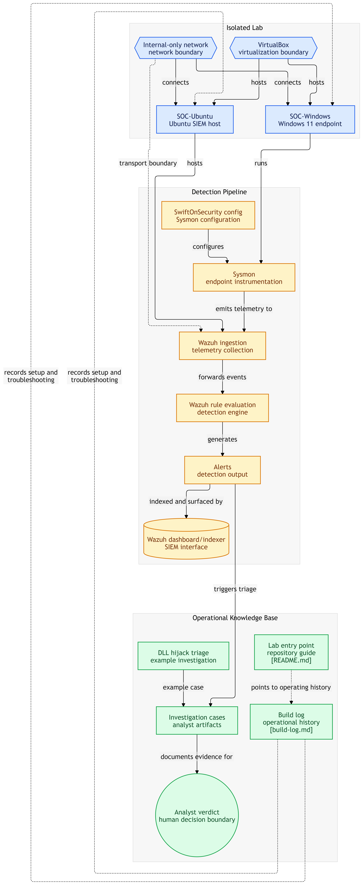

# SOC Home Lab

A hands-on Security Operations Center lab, built from scratch to practice real detection and investigation work, a genuine build with real troubleshooting and real alerts.

## Architecture

- **SOC-Windows** — Windows 11 VM (victim/endpoint), instrumented with Sysmon (SwiftOnSecurity config) for rich telemetry
- **SOC-Ubuntu** — Ubuntu VM running Wazuh (server, indexer, dashboard) as the SIEM
- Both VMs isolated on an internal VirtualBox network
## SOC Lab Architecture

The lab uses an isolated VirtualBox environment with a Windows 11 endpoint and an Ubuntu-based Wazuh monitoring environment. Windows telemetry is collected through Sysmon and processed by Wazuh for detection and investigation.

## What's in this repo

- [`docs/build-log.md`](docs/build-log.md) — a running, dated log of the build process, including the actual issues hit and how they were diagnosed and fixed
- [`docs/investigations/`](docs/investigations/) — write-ups of real alerts investigated in the lab, each following: Alert → Evidence → Reasoning → Verdict → What would change the verdict, with MITRE ATT&CK mapping where relevant
## Highlight: Investigation 02

[**Possible DLL Search Order Hijack**](docs/investigations/02-dll-search-order-hijack.md) — a real alert from the lab's Wazuh rule engine, triaged using rule frequency, process context, and MITRE ATT&CK mapping to reach a benign verdict, with reasoning for what would change that conclusion.

## Why this exists

Built as a portfolio project targeting SOC Analyst L1 roles, to demonstrate hands-on detection engineering and investigative reasoning rather than just certifications.

## Status

Actively in progress — new investigations and build-log entries are added as the lab develops.
